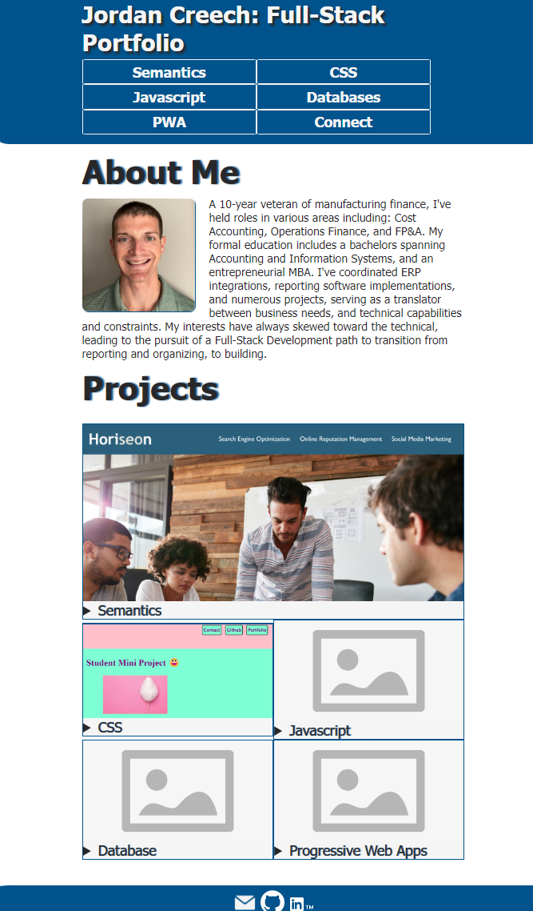

# Jordan Creech Full-Stack Portfolio Page

## Description

This is the full-stack portfolio of Jordan Creech. It utilizes a simple, stream-lined layout to display a few sample projects, a short bio for Jordan, and links to Jordan's email, GitHub, and LinkedIn profile.

## Usage

This site serves as a portfolio of projects collected as examples of technical competencies for future employers to view.  
It will also be a continuous work-in-progress itself, providing a test stage for implementing new development skills as I learn them.

A menu is provided at the top that navigates to the respective section of the page.  
Project images are displayed in the main content area of the page and can be clicked to follow links to each deployed project.  
Image captions can be expanded for text elaborating on the details of each.

The site can be viewed at: !!! Add deployed link !!!

## Credits

Several sites were referenced as inspiration for this site.  
Those used for specific coding examples or resources are listed below:

navigation menu:
https://www.w3schools.com/csS/css_navbar_horizontal.asp

font (and other accessibility considerations):
https://www.accessibilitychecker.org/blog/accessible-fonts/

details and summary elements:
https://developer.mozilla.org/en-US/docs/Web/HTML/Element/details

flexbox:
https://css-tricks.com/snippets/css/a-guide-to-flexbox/
https://www.w3schools.com/howto/howto_css_image_grid_responsive.asp
https://developer.mozilla.org/en-US/docs/Web/CSS/CSS_Flexible_Box_Layout/Mastering_Wrapping_of_Flex_Items

LinkedIn Logo Source:
https://brand.linkedin.com/content/brand/global/en_us/index/visual-identity/logo

GitHub Logo Source:
https://github.com/logos

email icon source:
https://vectorified.com/images/email-icon-white-png-38.png

placeholder image:
https://www.pngkey.com/png/detail/233-2332677_ega-png.png

colors:
background: https://cssgradient.io/shades-of-blue/

## License

Please refer to LICENSE included in repository